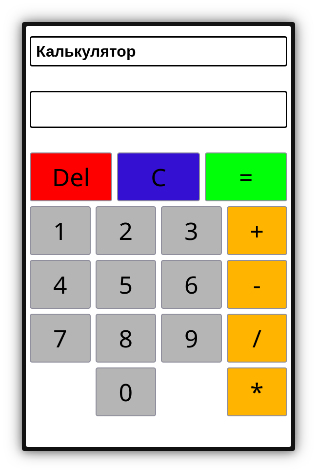

# React Калькулятор

### Простой калькулятор на React, сделанный в процессе изучения хуков и работы с состоянием.

# [Доступен на GitHub Pages](https://farayw.github.io/react-calculator/)



## Возможности

- Базовые операции: сложение, вычитание, умножение, деление
- Ввод многозначных чисел
- Удаление последнего символа (`Del`)
- Полная очистка (`C`)
- Цепочка вычислений без промежуточного нажатия `=` (например, `1 + 1 + 1` без остановки на промежуточном результате)

## Стек

- React (функциональные компоненты, хуки)
- `useState` для хранения состояния
- Чистый CSS для стилей

## Установка и запуск

```bash
git clone https://github.com/FarayW/react-calculator.git
cd react-calculator
npm install
npm start
```

Приложение откроется на http://localhost:3000

## Структура проекта

```
src/
├── components/
│   └── numberButton.jsx   # Кнопка цифры, переиспользуемый компонент
├── styles/
│   └── calculator.css     # Стили калькулятора
├── public/
│   └── index.html
├── App.jsx                # Основная логика и разметка
└── index.js
```

## Как устроена логика

Состояние калькулятора хранится в трёх независимых полях:

- `display` - текущий ввод и то, что видно на экране
- `prevValue` - число, зафиксированное до выбора оператора
- `operator` - выбранный оператор (`+`, `-`, `*`, `/`)

Вычисление выполняется чистой функцией `calculate(a, b, op)`, не зависящей от состояния компонента - она просто принимает два числа и оператор и возвращает результат. Это позволяет реализовать цепочку вычислений (`5 + 3 - 2`) без промежуточного нажатия `=`: при выборе нового оператора текущий результат сначала пересчитывается на основе предыдущего значения, а затем становится новым `prevValue`.

## Чему научился в процессе / проблемы с которыми столкнулся

- Разница между `useState` и обычными переменными в теле компонента: только состояние переживает повторный рендер
- Обработчик события "помнит" старые значения состояния — они не обновляются мгновенно, а только на следующем рендере
- Вынесение вычислений в чистую функцию делает логику предсказуемой и независимой от порядка обновления состояния